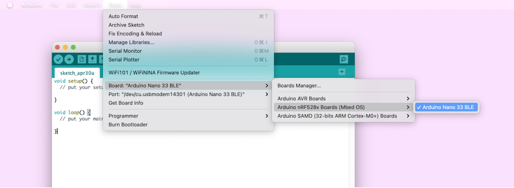
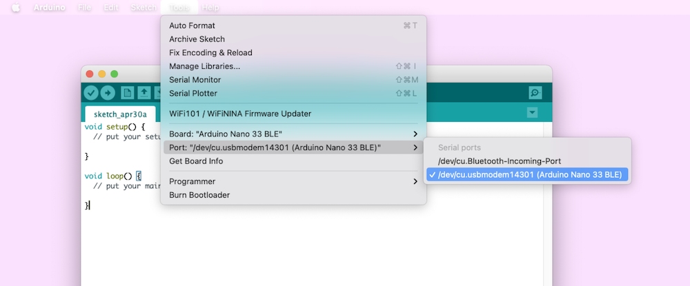
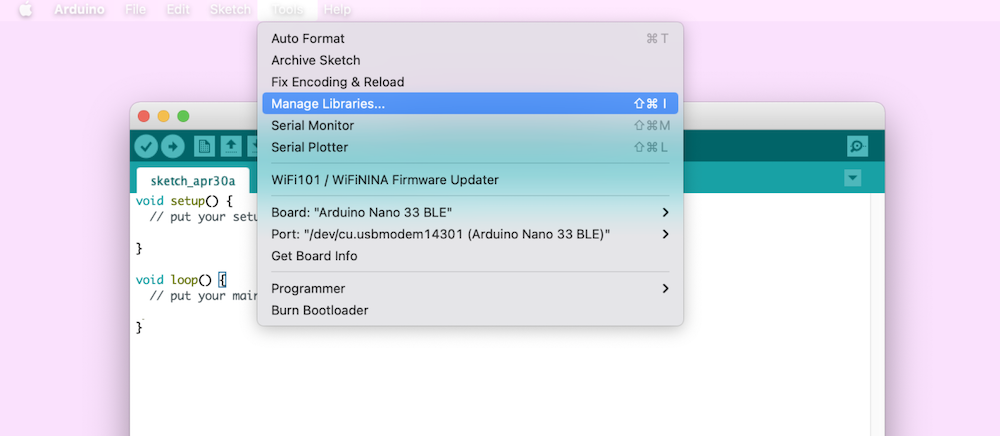
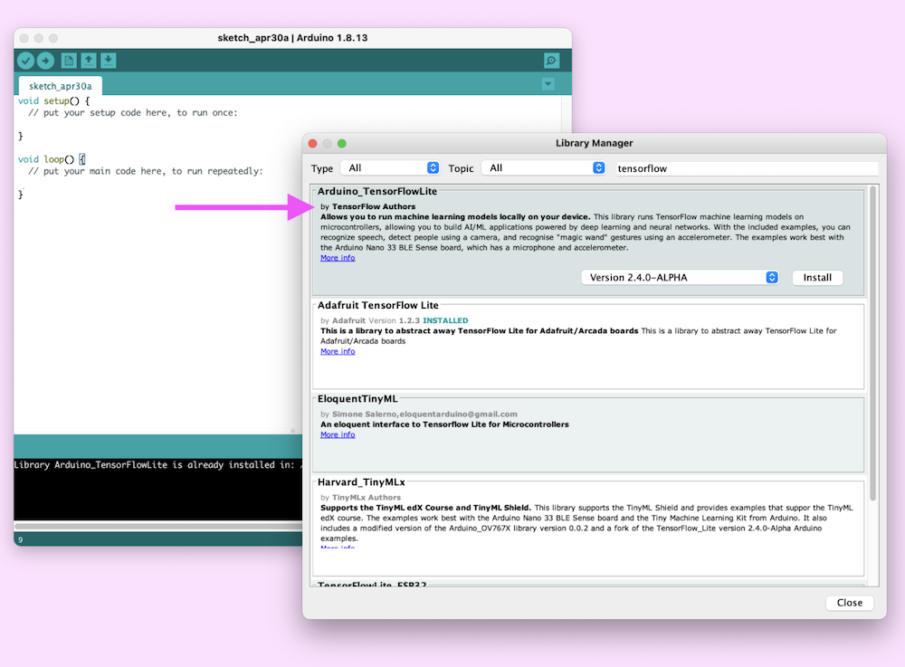

# Air Street Fighter with Arduino and TensorFlow Lite

This project is a prototype of Street Fighter game you play by moving your arms in the air, as if you were doing a "punch", "hadoken", or "shoryuken".

[Live demo](https://air-street-fighter.netlify.app)

To be able to use it, you need an Arduino 33 Nano BLE Sense, and follow the steps to pre-install the TFMicro Motion Kit on it.

## Install and run

Flashing: Using the Arduino Nano Sense 33 BLE

1. Install the [Arduino IDE](https://www.arduino.cc/en/software)

2. Setup Arduino board:

- Plug in the board

- Install the board by navigating to Tools > Board > Boards Manager and search for Arduino Mbed OS Nano Boards. Full instructions (including drivers required for Windows) [here](https://www.arduino.cc/en/Guide/NANO33BLESense).

- After the board is installed, select it under to Tools > Board > Arduino Mbed OS Nano Boards > Arduino Nano 33 BLE

- Select the port by navigating to Tools -> Port -> dev/cu... (Arduino Nano 33 BLE)

3. Install Arduino libraries

- Navigate to Tools > Manage Libraries
- Search for and install:
  - Arduino_LSM9DS1
  - ArduinoBLE
  - Arduino_TensorFlowLite

4. Open the sketch and flash

- Download the latest release [here](https://github.com/googlecreativelab/tf4micro-motion-kit/releases/tag/v005)
- Open the arduino/tf4micro-motion-kit and double click on <tf4micro-motion-kit.ino> file
- Click the Right arrow in the top left corner to build and upload the sketch.
- Warning: This process may take a few minutes. Also, warnings may populate but the upload should still succeed in spite of them.
- If the sketch is installed, the LED on the board should flash red and green.

5. Visit https://air-street-fighter.netlify.app

## Running the app locally

- Clone the repo
- Install the dependencies with `npm install`
- Start the server with `node serve.js`
- The browser should open on port 8080
